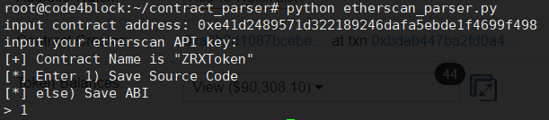

# Contract Code & ABI parser

## Environment
Ubuntu, Linux

python 2.xx / 3.xx

## Requirement
```
pip install requests
pip install bs4
pip install json
```
## Components
* Simple Contract Parser
[etherscan_parser.py](./etherscan_parser.py)

* Token Parser
[token_parser](./etherscan/parser_library.py)


### How to use Simple Contract Parser



### How to use Token Parser

```
import sys
sys.path.append('../')

from parser_library import token

t = token()
t.get_address(1)
t.save_address('page-1', path='../address/')

```

You can easily use the modules by checking the following examples.

[example](./etherscan/example)


